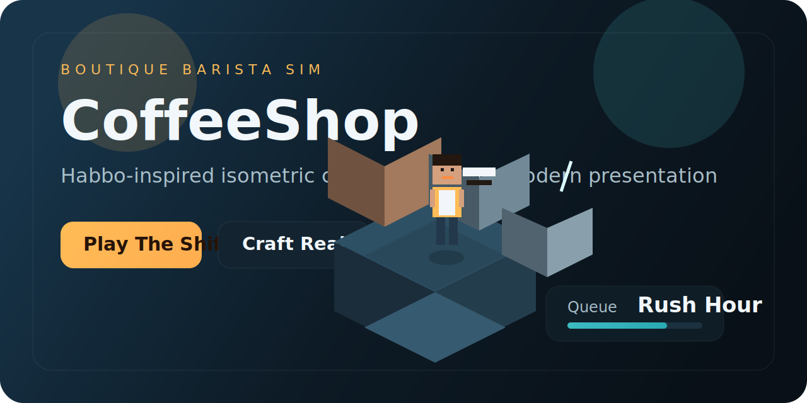
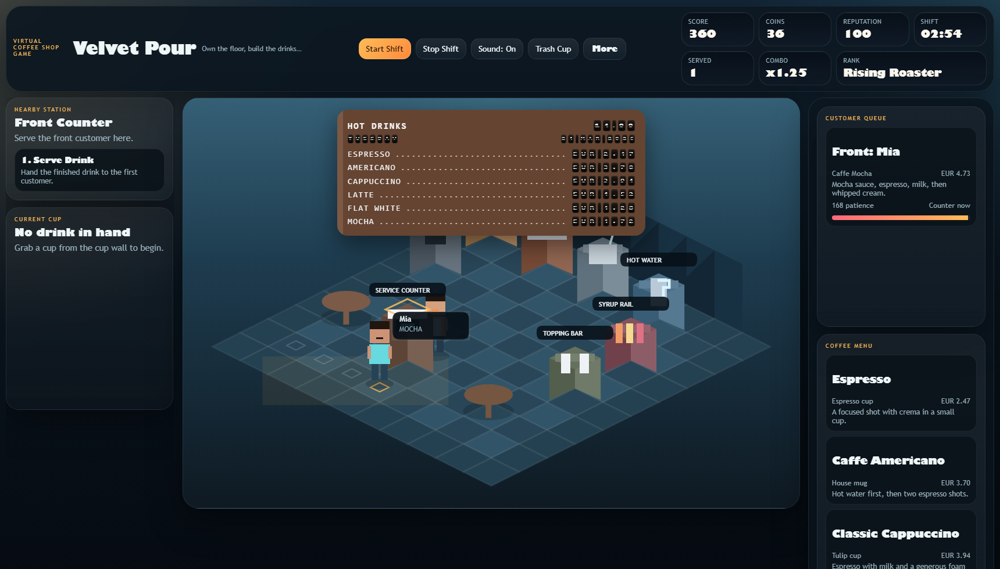
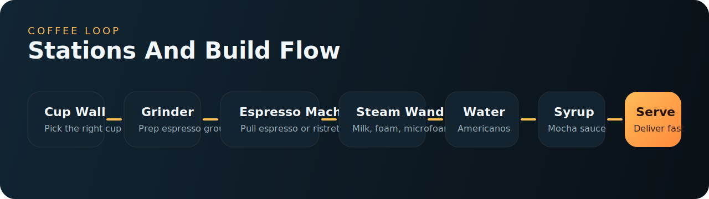

# CoffeeShop

Modern browser coffee-shop game with a Habbo-inspired isometric room, station-based drink crafting, live board pricing, player and restaurant customization, and separate music/sound systems.



## Preview





## What It Is

You play as the barista-owner of a stylized virtual coffee shop. Customers enter with espresso drink orders, and you move between the cup wall, grinder, espresso machine, steam wand, water tap, syrup rail, topping bar, and service counter to build each drink in the correct order.

The current build includes:

- Isometric room layout with Habbo-style movement feel and a modern visual treatment
- Click-to-move plus `WASD` and arrow-key controls
- Randomized customer queue with patience pressure
- Recipe-driven coffee crafting for espresso, americano, cappuccino, latte, flat white, and mocha
- Score, combo, coins, reputation, and shift timer systems
- Split-flap style live menu board with time and euro price updates
- Separate `Sound` and `Music` toggles for machine SFX and background ambience
- Machine-specific audio for cups, grinder, espresso shots, water, steam, syrup, foam, whip, and service flow
- Customer reaction bubbles and feedback for successful service or missed patience windows
- Character Studio for player customization
- Restaurant Studio for wall, floor, table, counter, and machine-finish customization
- Coffee Trainee Zone for learning recipes and drink procedures before a shift

## Key Features

- `Game Zone`: Main playable cafe where you prepare orders, work the queue, and manage score, combo, coins, and reputation.
- `Live Flip Board`: The in-room hot-drinks board reorders itself by current live price and animates updates with a flip-clock style treatment.
- `Coffee Menu`: A stable side menu that lists the drinks, base notes, and live euro prices without changing order.
- `Character Studio`: Customize gender, cap, lower wear, hair style, accessories, colors, and apron; the same avatar appears in-game.
- `Restaurant Studio`: Preview and change the live cafe look, including wall theme, floor theme, table count, table finish, machine finish, and counter finish.
- `Coffee Trainee Zone`: Review coffee steps, tools, and recipe notes for every drink on the menu.
- `Audio System`: Background music plays separately from action sound effects, so ambience and gameplay feedback can be controlled independently.
- `Customer Feedback`: Happy and angry reactions appear in the room depending on whether the drink is served correctly and on time.

## Coffee Procedures

Recipes are modeled from current coffee references and official Starbucks At Home preparation guides:

- [Coffee Association of Canada: Styles of Coffee](https://coffeeassoc.com/coffee-101/styles-of-coffee/)
- [Starbucks At Home: Classic Cappuccino](https://athome.starbucks.com/recipe/classic-cappuccino)
- [Starbucks At Home: Caffe Latte](https://athome.starbucks.com/recipe/caffe-latte)
- [Starbucks At Home: Caffe Mocha](https://athome.starbucks.com/recipe/caffe-mocha)
- [Starbucks At Home: Flat White](https://athome.starbucks.com/recipe/flat-white)
- [Starbucks At Home: Caffe Americano](https://athome.starbucks.com/recipe/caffe-americano)

## Controls

- Move: click a floor tile or use `WASD` / arrow keys
- Use station action: click the action buttons or press `1`, `2`, or `3`
- Quick action: press `Space`
- Trash current drink: click `Trash Cup`
- Toggle action sounds: click `Sound`
- Toggle background music: click `Music`
- Open extra views and rules: click `More`

## Run Locally

Open [index.html](./index.html) directly in a browser.

Or run a simple static server:

```powershell
python -m http.server 8000
```

Then open `http://localhost:8000`.

## Project Files

- [index.html](./index.html): app structure and gameplay shell
- [styles/app.css](./styles/app.css): responsive UI, layout framing, panel behavior, and board animations
- [scripts/data.js](./scripts/data.js): recipes, stations, customer looks, avatar options, and restaurant options
- [scripts/game.js](./scripts/game.js): gameplay systems, rendering, machine audio, reactions, and customization sync
- [scripts/main.js](./scripts/main.js): UI rendering, board updates, studio forms, and menu interactions
- [tools/browser-check.mjs](./tools/browser-check.mjs): local browser QA and screenshot capture
