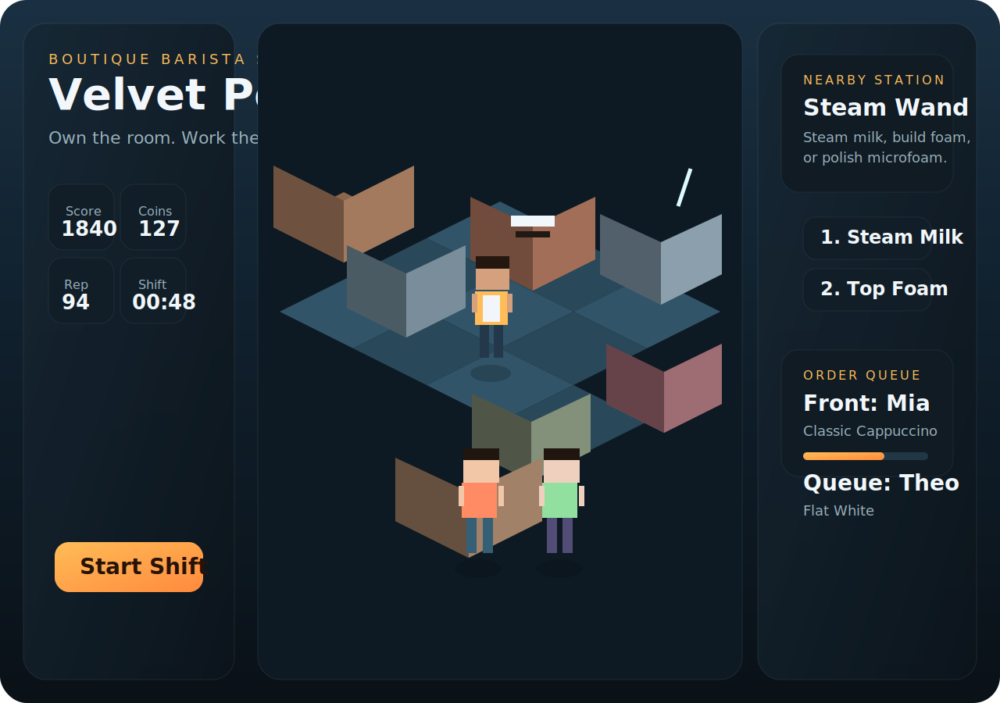

# CoffeeShop

Modern browser coffee-shop game with a Habbo-inspired isometric room, station-based drink crafting, random customer orders, and built-in sound effects.


## Preview



## What It Is

You play as the barista-owner of a stylized virtual coffee shop. Customers enter with espresso drink orders, and you move between the cup wall, grinder, espresso machine, steam wand, water tap, syrup rail, topping bar, and service counter to build each drink in the correct order.

The current build includes:

- Isometric room layout with Habbo-style movement feel and a modern visual treatment
- Click-to-move plus `WASD` and arrow-key controls
- Randomized customer queue with patience pressure
- Recipe-driven coffee crafting for espresso, americano, cappuccino, latte, flat white, and mocha
- Score, combo, coins, reputation, and shift timer systems
- Built-in Web Audio sound effects and ambient cafe texture

## Coffee Procedures

Recipes are modeled from current coffee references and official Starbucks At Home preparation guides:

- [Coffee Association of Canada: Styles of Coffee](https://coffeeassoc.com/coffee-101/styles-of-coffee/)
- [Starbucks At Home: Classic Cappuccino](https://athome.starbucks.com/recipe/classic-cappuccino)
- [Starbucks At Home: Caffe Latte](https://athome.starbucks.com/recipe/caffe-latte)
- [Starbucks At Home: Caffe Mocha](https://athome.starbucks.com/recipe/caffe-mocha)
- [Starbucks At Home: Flat White](https://athome.starbucks.com/recipe/flat-white)
- [Starbucks At Home: Caffe Americano](https://athome.starbucks.com/recipe/caffe-americano)

## Controls

- Move: click a floor tile or use `WASD` / arrow keys
- Use station action: click the action buttons or press `1`, `2`, or `3`
- Quick action: press `Space`
- Trash current drink: click `Trash Cup`

## Run Locally

Open [index.html](./index.html) directly in a browser.

Or run a simple static server:

```powershell
python -m http.server 8000
```

Then open `http://localhost:8000`.

## Project Files

- [index.html](./index.html): app structure and UI shell
- [styles.css](./styles.css): modern glassmorphism and responsive layout styling
- [script.js](./script.js): gameplay, rendering, recipes, customers, and sound

## Extra Visual


